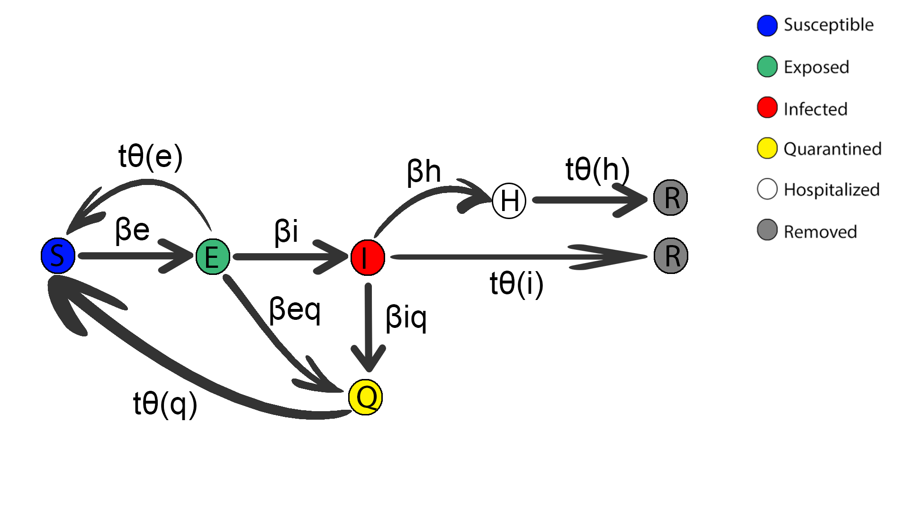

# Modeling the impact of quarantine during the COVID-19

The purpose of this project is to determine through an agent-based model the importance of the identification of COVID-19 positive people, and the implementation of measures containment, such as quarantine, necessary to prevent the virus from spreading founded. In this study I try to demonstrate the importance of the testing phase and the obligation quarantine for infected individuals and their closest contacts. Locate a positive or the close contacts of a positive in the shortest possible time allows quarantine it in a timely manner and avoid spreading the virus. The compartmental model developed is a SEIQJR model.

